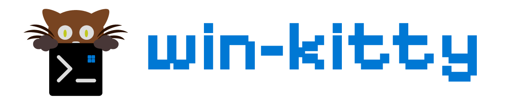

<p align="left">
  
</p>

> **kitty, running natively on Windows. No WSL, no X server, no compromise.**

[](https://github.com/ecstra/win-kitty/actions/workflows/windows.yml) [](https://github.com/ecstra/win-kitty/actions/workflows/ci.yml) [](https://opensource.org/licenses/GPL-3.0) [](https://github.com/ecstra/win-kitty/releases) [](https://sw.kovidgoyal.net/kitty/)

> [!IMPORTANT]
> This is a fork of [kitty](https://github.com/kovidgoyal/kitty) that adds a native Windows port. None of it is upstream, so anything about the Windows build belongs [here](https://github.com/ecstra/win-kitty/issues) and not on the upstream tracker.
>
> The port is young and has plenty of bugs. Daily use works, and the feature list below has been used enough to trust, but anything off that path is likely to be rough.

kitty is a fast, GPU based terminal. This fork makes it run on Windows directly. Windows console programs run through the pseudoconsole API, MSYS2 and Cygwin shells run on a real Cygwin pty so they behave the way they do on Linux, and the terminal is drawn with OpenGL through the same rendering path kitty uses everywhere else.

## Install

Grab `kitty-setup.exe` from the [latest release](https://github.com/ecstra/win-kitty/releases/latest) and run it. It asks for administrator rights, installs to `C:\Program Files\kitty`, and offers to add kitty to your PATH, to add an **Open in kitty** entry to the Explorer right click menu, and to create a desktop shortcut.

Nothing else is needed. Python, every MinGW DLL, and the terminfo are bundled, and the build is smoke tested against a cleaned PATH so a missing dependency fails the build rather than you.

To install without prompts:

```
kitty-setup.exe /VERYSILENT /SUPPRESSMSGBOXES /NORESTART
```

## What works

- Tabs and OS windows, scrollback, mouse selection, and the Windows clipboard.
- **Real Windows 11 acrylic** behind the terminal, which keeps its material when the window loses focus, and a title bar kitty draws itself so the caption matches the terminal background.
- **Any shell.** pwsh, Windows PowerShell, and cmd through a pseudoconsole. zsh, bash, and the rest of MSYS2 or Cygwin on a genuine pty, with shell integration for each. A fresh install opens pwsh.
- **Kittens**, including icat, hints, unicode_input, diff, themes, and choose-files.
- Desktop notifications as real Windows toasts.
- Dropping files and text onto a window.
- Config reloading, so a theme applied from the themes kitten shows up without a restart.
- Fonts and ligatures, per monitor DPI scaling, and the real refresh rate of your monitor rather than an assumed 60 Hz.

## What is missing

- **Remote control**, meaning `kitty @` and the `listen_on` option. kitty drives it over a Unix domain socket and Windows Python has no `socket.AF_UNIX`.
- **Four kittens**, namely dnd, panel, quick-access-terminal, and desktop-ui. They are marked in the `kitten` command list and refuse cleanly.
- **Dragging content out** of a window. Dropping onto one works.
- The `kitty +something` entry points and the full `kitty --help` option list when run from another terminal.

Kittens deliberately refuse to start outside kitty on Windows, because they depend on kitty's own input and output path. Inside kitty they work. [docs/windows-port.md](docs/windows-port.md) has the full list, including what is simply untested.

## Build it yourself

You need the MSYS2 mingw64 toolchain, its build of Python 3, and Go. From git-bash or an MSYS2 shell:

```bash
./packaging/windows/make-installer.sh
```

That one command builds everything and produces `dist/kitty-setup.exe`. Every push builds the same installer in CI, so a green run always has one attached.

## Documentation

- [docs/windows-port.md](docs/windows-port.md): installing, building, the Windows defaults, and what is not there yet.
- [docs/windows-internals.md](docs/windows-internals.md): how each Windows piece works, from the pty bridge to the acrylic.
- [docs/decisions.md](docs/decisions.md): why the choices were made, including the ones that were reversed.
- [CONTRIBUTING.md](CONTRIBUTING.md): where to report things, and what to include.

## Credits

kitty is created and maintained by [Kovid Goyal](https://github.com/kovidgoyal). This fork only adds the Windows port, by **ecstra**. Everything that makes kitty good is his work, and the upstream documentation at [sw.kovidgoyal.net/kitty](https://sw.kovidgoyal.net/kitty/) applies here too.

Licensed under GPLv3, the same as upstream.
